# ✈️ flights-data-engineering-a

**End-to-End Data Engineering Pipeline — U.S. Domestic Flights 2015**

> Tarea 08 · Maestría en Ciencia de Datos · ITAM 2026
>
> **Branch:** `feature/data-engineering-flights`

---

## 👥 Autores

- José Antonio Esparza
- Gustavo Pardo 

---

## 📋 Descripción General

Este proyecto construye, de principio a fin, un **pipeline de datos** sobre el dataset de vuelos domésticos de Estados Unidos del año 2015, que contiene aproximadamente **5.8 millones de registros**. Abarca ingestión, transformación, almacenamiento, modelado relacional y análisis avanzado.

El diseño sigue la **arquitectura Medallion** (Bronze → Silver → Gold) sobre Amazon S3, con catalogación en AWS Glue, consultas analíticas en Amazon Athena, persistencia relacional en PostgreSQL (Amazon RDS) y un análisis exploratorio y predictivo en Jupyter Notebook.

| Aspecto | Detalle |
|---|---|
| **Dataset** | U.S. Domestic Flights 2015 (~5.8 M registros) |
| **Arquitectura** | Medallion (Bronze / Silver / Gold) |
| **Almacenamiento** | Amazon S3 + Parquet |
| **Catálogo** | AWS Glue Data Catalog |
| **Consultas** | Amazon Athena |
| **Base de datos** | PostgreSQL en Amazon RDS |
| **Análisis** | Jupyter Notebook (pandas, scikit-learn, statsmodels) |

---

## 🏗️ Arquitectura del Proyecto

### Arquitectura Medallion

```
┌─────────────────────────────────────────────────────────────────────────────────┐
│                          MEDALLION ARCHITECTURE                                 │
│                                                                                 │
│  ┌──────────────┐      ┌──────────────┐      ┌──────────────┐                  │
│  │              │      │              │      │              │                  │
│  │   🥉 BRONZE  │─────▶│   🥈 SILVER  │─────▶│   🥇 GOLD    │                  │
│  │              │      │              │      │              │                  │
│  └──────┬───────┘      └──────┬───────┘      └──────┬───────┘                  │
│         │                     │                     │                          │
│    Raw Ingestion         Aggregations          Denormalized                    │
│    CSV → Parquet         Business KPIs         Analytical Table                │
│                                                                                 │
│  ┌──────────────────────────────────────────────────────────────────────────┐   │
│  │                        AWS SERVICES                                      │   │
│  │  S3 (Storage)  ·  Glue (Catalog)  ·  Athena (Query)  ·  RDS (RDBMS)    │   │
│  └──────────────────────────────────────────────────────────────────────────┘   │
└─────────────────────────────────────────────────────────────────────────────────┘
```

#### 🥉 Bronze — Ingestión Cruda

| Aspecto | Detalle |
|---|---|
| **Propósito** | Copia fiel del dataset original sin transformaciones |
| **Formato** | Parquet (convertido desde CSV) |
| **Tablas** | `flights` · `airlines` · `airports` |
| **S3** | `s3://<bucket>/flights/bronze/{tabla}/` |
| **Glue DB** | `flights_bronze` |
| **Script** | `etl/bronze.py` |

```
CSV (local)  ──▶  Validate  ──▶  Parquet (S3)  ──▶  Glue Catalog
```

**Evidencia — Glue Catalog Bronze:**

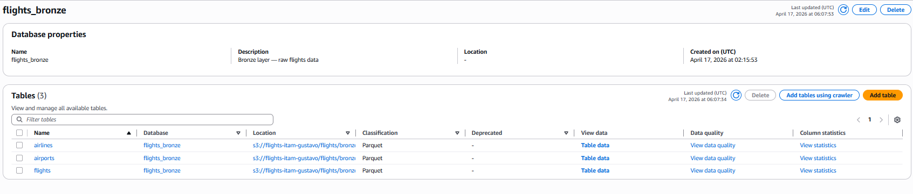

**Evidencia — S3 Bucket Bronze:**

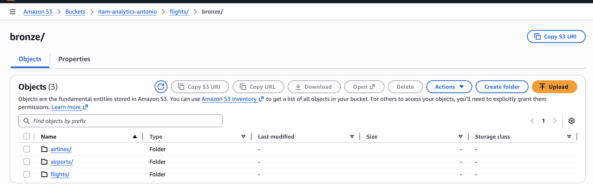

#### 🥈 Silver — Agregaciones de Negocio

| Aspecto | Detalle |
|---|---|
| **Propósito** | Métricas agregadas por día, mes/aerolínea y aeropuerto |
| **Formato** | Parquet + Snappy |
| **S3** | `s3://<bucket>/flights/silver/{tabla}/` |
| **Glue DB** | `flights_silver` |
| **Script** | `etl/silver.py` |

| Tabla Silver | Agrupación | Métricas |
|---|---|---|
| `flights_daily` | YEAR, MONTH, DAY | total_flights, total_delayed, total_cancelled, avg_departure_delay, avg_arrival_delay |
| `flights_monthly` | MONTH, AIRLINE | total_flights, total_delayed, total_cancelled, avg_arrival_delay, on_time_pct |
| `flights_by_airport` | ORIGIN_AIRPORT | total_departures, total_delayed, total_cancelled, avg_departure_delay, pct_weather_delay |

```
Bronze (S3 Parquet)  ──file-by-file──▶  Partial Aggs  ──combine──▶  Silver (S3 + Glue)
```

**Evidencia — Glue Catalog Silver:**

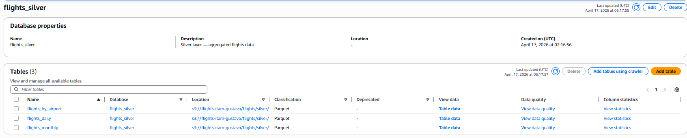

**Evidencia — S3 Bucket Silver:**


#### 🥇 Gold — Tabla Analítica Desnormalizada

| Aspecto | Detalle |
|---|---|
| **Propósito** | Vista desnormalizada lista para consumo analítico |
| **Método** | CTAS ejecutado en Athena (JOINs sobre Bronze) |
| **Tabla** | `vuelos_analitica` (~5.8M filas, 20 columnas) |
| **S3** | `s3://<bucket>/flights/gold/` |
| **Glue DB** | `flights_gold` |
| **Script** | `etl/gold.py` |

```
Bronze tables (Glue)  ──CTAS (Athena)──▶  Gold analytical table (S3 + Glue)

  flights ──┐
  airlines ─┤── LEFT JOINs ──▶  vuelos_analitica
  airports ─┘
```

**Evidencia — Glue Catalog Gold:**

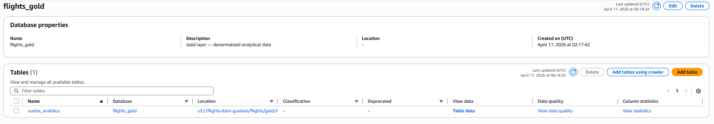

**Evidencia — S3 Bucket Gold:**

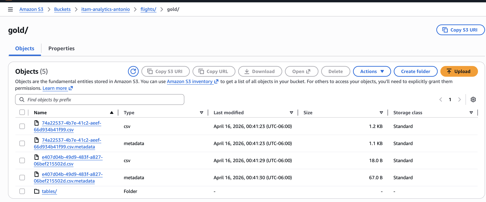

> **Nota:** El CTAS se construye sobre Bronze para demostrar que Gold puede
> construirse desde cualquier capa. En producción se construiría desde Silver
> para aprovechar el Parquet ya procesado.

#### Flujo End-to-End

```
  download_data.sh          bronze.py              silver.py               gold.py
  ┌──────────┐        ┌──────────────┐       ┌──────────────┐       ┌──────────────┐
  │ Download │──CSV──▶│  Ingest Raw  │──S3──▶│  Aggregate   │──S3──▶│  CTAS Join   │
  │   CSVs   │        │  to Parquet  │       │  KPIs        │       │  Denormalize │
  └──────────┘        └──────┬───────┘       └──────┬───────┘       └──────┬───────┘
                             │                      │                      │
                        Glue: flights_bronze   Glue: flights_silver   Glue: flights_gold
                        ├─ flights             ├─ flights_daily       └─ vuelos_analitica
                        ├─ airlines            ├─ flights_monthly
                        └─ airports            └─ flights_by_airport
```

---

## 🛠️ Tecnologías Utilizadas

| Categoría | Herramientas |
|---|---|
| **Lenguaje** | Python 3.10+ |
| **Cloud** | AWS (S3, Glue, Athena, RDS) |
| **Almacenamiento** | Amazon S3 (Parquet, CSV) |
| **Catálogo** | AWS Glue Data Catalog |
| **Consultas** | Amazon Athena |
| **Base de datos** | PostgreSQL 15 (Amazon RDS) |
| **ETL** | awswrangler, boto3, pandas, pyarrow |
| **Análisis** | pandas, matplotlib, statsmodels |
| **Modelado** | statsmodels (OLS), statsforecast (AutoETS, AutoARIMA, AutoTheta), scikit-learn |
| **BD** | SQLAlchemy, psycopg2 |
| **Infraestructura** | CloudFormation (YAML) |
| **Notebook** | Jupyter / JupyterLab |
| **Control de versiones** | Git + GitHub |

---

## 📁 Estructura del Repositorio
```
flights-data-engineering-a/
├── .github/
│   └── workflows/
│       └── pylint.yml      → CI: lint automático en cada push/PR
├── artifacts/
│   └── screenshots/        → Evidencia de S3 bucket (Bronze, Silver, Gold)
├── config/                 → Variables AWS, credenciales y conexiones
│   └── __init__.py
├── data/                   → Datos crudos descargados (no versionados)
│   └── flights/
│       ├── flights.csv
│       ├── airlines.csv
│       └── airports.csv
├── db/                     → Scripts de creación y carga de BD
│   └── setup_db.py
├── docs/                   → Diagrama ER y documentación técnica
│   ├── erd-flights.drawio
│   ├── erd-flights.png
│   ├── html/               → Documentación de docstrings (pdoc)
│   └── screenshots/        → Evidencia de queries P1–P5, W1–W3 y regresión
├── etl/                    → Pipeline Medallion (Bronze → Silver → Gold)
│   ├── bronze.py
│   ├── silver.py
│   └── gold.py
├── infra/                  → CloudFormation templates para RDS PostgreSQL
│   └── rds-flights.yaml
├── logs/                   → Logs de ejecución ETL (generados en runtime)
├── notebooks/              → EDA, regresión lineal y forecasting
│   └── flights_analytics.ipynb
├── sql/                    → (reservado para queries SQL adicionales)
├── src/                    → Utilities: S3 client, PostgreSQL connector
│   └── __init__.py
├── tests/                  → Unit tests y data quality checks
│   └── __init__.py
├── .gitignore
├── .pylintrc
├── download_data.sh        → Descarga los CSVs del dataset
├── README.md
└── requirements.txt
```

---

## ⚙️ Pipeline ETL

### Bronze — `etl/bronze.py`

```bash
python etl/bronze.py --bucket <tu-bucket> --data-dir data/flights/
```

- Lee los 3 archivos CSV originales (`flights.csv`, `airlines.csv`, `airports.csv`).
- Convierte a Parquet y sube a `s3://<bucket>/flights/bronze/{tabla}/`.
- `flights.csv` (~5.8M filas) se procesa en chunks de 500K filas para evitar OOM.
- Registra las tablas en Glue Data Catalog (`flights_bronze`).

### Silver — `etl/silver.py`

```bash
python etl/silver.py --bucket <tu-bucket>
```

- Lee Bronze archivo por archivo (sin Ray) con solo las columnas necesarias.
- Computa agregaciones parciales por chunk y las combina al final.
- Genera 3 tablas Silver: `flights_daily`, `flights_monthly`, `flights_by_airport`.
- `flights_daily` particionada por `MONTH` (`overwrite_partitions`).
- Todas registradas en Glue Data Catalog (`flights_silver`).

### Gold — `etl/gold.py`

```bash
python etl/gold.py --bucket <tu-bucket>
```

- Verifica que las tablas Bronze existan en Glue.
- Ejecuta un CTAS en Athena que une `flights` + `airlines` + `airports`.
- Genera la tabla desnormalizada `vuelos_analitica` (20 columnas).
- Valida que `airline_name`, `origin_airport_name` y `destination_airport_name` estén poblados.

---

### Buenas Prácticas Implementadas

| Práctica | Implementación |
|---|---|
| **Idempotencia** | Bronze: `overwrite` / `append` por chunks. Silver: `overwrite_partitions` y `overwrite`. Gold: `delete_table_if_exists` + limpieza S3 antes de CTAS. |
| **Memory-safe** | Bronze: chunks de 500K filas. Silver: lectura file-by-file, solo 15 columnas, `gc.collect()`. Gold: Athena ejecuta el CTAS (sin carga en RAM). |
| **Logging profesional** | Módulo `logging` con handlers a consola + archivo (`logs/{capa}_etl.log`). Timestamps, fases claramente delimitadas, cifras de control al final. |
| **Manejo de errores** | `try/except` en cada fase con `logger.exception()` + `raise`. `main()` captura todo y hace `sys.exit(1)`. |
| **Docstrings** | Todas las funciones documentadas con descripción, `Args`, `Returns` y `Raises`. |
| **Modularidad** | Patrón `extract → transform → load → main` en cada script. Funciones con responsabilidad única. |
| **Cifras de control** | Cada script imprime al final: filas procesadas, tablas generadas, tiempos por fase. |
| **CLI** | `argparse` con `--bucket` (y `--data-dir` en Bronze). Ayuda con `--help`. |
| **Pylint** | Bronze: 9.38/10. Silver: 9.49/10. Gold: 9.40/10. |

---

## 📊 Análisis y Modelado (`notebooks/flights_analytics.ipynb`)

El notebook conecta a las tres capas del pipeline (Bronze vía RDS, Silver y Gold vía Athena) para realizar análisis exploratorio, regresión y pronóstico.

### Fuentes de datos utilizadas

| Fuente | Conexión | Uso |
|---|---|---|
| **PostgreSQL (RDS)** | SQLAlchemy + psycopg2 | Queries analíticas y window functions |
| **Silver (Athena)** | awswrangler | Serie de tiempo de vuelos mensuales |
| **Gold (Athena)** | awswrangler | Datos desnormalizados para regresión |

### Análisis Exploratorio (EDA)

| Análisis | Tipo de gráfico | Fuente |
|---|---|---|
| Top 10 rutas con más vuelos | Barras horizontales | RDS |
| Top 5 aerolíneas con mayor % de cancelaciones | Barras horizontales | RDS |
| Cancelaciones por causa (A/B/C/D) | Barras verticales | RDS |
| Retraso promedio de salida por mes | Línea temporal | RDS |
| Top 10 aeropuertos con más weather delay | Barras horizontales | RDS |
| Vuelo con mayor retraso por aerolínea | Tabla con Window Function (`RANK`) | RDS |
| Cambio porcentual de vuelos mes a mes | Línea + barras (LAG) | Silver/Athena |
| Primeros 5 vuelos del día en LAX | Tabla con `ROW_NUMBER` | RDS |

### Regresión Lineal (OLS)

- **Variable dependiente:** `arrival_delay`
- **Variables independientes:** `departure_delay`, `distance`, `air_system_delay`, `airline_delay`, `weather_delay`, `late_aircraft_delay`, `security_delay`
- **Fuente de datos:** `flights_gold.vuelos_analitica` (muestra de 100K filas)
- **Librería:** `statsmodels.OLS`


**Visualizaciones de diagnóstico:**

| Visualización | Screenshot |
|---|---|
| Coeficientes con intervalos de confianza al 95% | 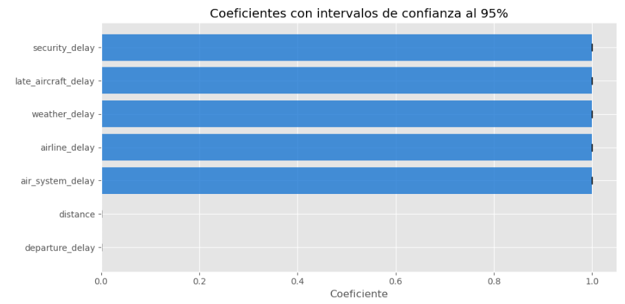 |
| Scatter: predichos vs reales |  |
| Residuos vs predichos |  |
| Q-Q Plot de residuos | *(generado en notebook)* |

> Los 5 componentes de retraso tienen coeficientes ≈ 1.0, confirmando que su suma equivale al `arrival_delay`. La multicolinealidad total es intencional y demuestra la relación determinística.

### Pronóstico de Series de Tiempo

- **Serie:** total de vuelos mensuales (12 meses de 2015)
- **Train:** ene–sep 2015 (9 meses) · **Test:** oct–dic 2015 (3 meses)
- **Horizonte de pronóstico:** 6 meses adelante (ene–jun 2016)
- **Librería:** `statsforecast`

| Modelo | Especificación | MAE (vuelos/mes) |
|---|---|---|
| AutoETS | (A,N,N) | 9,531 |
| **AutoARIMA** | ARIMA(0,1,0) | **9,512** ← mejor |
| AutoTheta | Theta no estacional | 18,735 |

**Visualizaciones:**
- Evaluación sobre test set con intervalos de confianza al 90%
- Pronóstico 6 meses adelante (ene–jun 2016)
- Comparación de MAE por modelo

> Con solo 9 puntos de entrenamiento, los modelos correctamente seleccionan especificaciones no estacionales. AutoARIMA logra el menor MAE.

---

## 🗄️ Modelo Relacional (PostgreSQL)

El modelo relacional está diseñado en **tercera forma normal (3NF)** y desplegado en una instancia de Amazon RDS PostgreSQL.

### Tablas en RDS

| Tabla | Descripción | Filas |
|---|---|---|
| `airlines` | Catálogo de aerolíneas (código IATA, nombre) | 14 |
| `airports` | Catálogo de aeropuertos (código IATA, ciudad, estado, latitud, longitud) | 322 |
| `flights` | Tabla de hechos: cada vuelo con atributos operativos, delays y cancelaciones | 500,000 |

### Diagrama Entidad-Relación

El diagrama ER se encuentra en:

- **Imagen**: [docs/erd-flights.png](docs/erd-flights.png)
- **Editable**: [docs/erd-flights.drawio](docs/erd-flights.drawio)

### Infraestructura

La instancia de PostgreSQL se aprovisiona mediante CloudFormation:

```bash
aws cloudformation deploy \
  --template-file infra/rds-flights.yaml \
  --stack-name flights-rds-stack \
  --parameter-overrides DBPassword=<your-password>
```

**Nota importante**: 

- `chmod +x download_data.sh` para dar permisos de ejecución
- `./download_data.sh` para ejecutar el script

---

## 🔍 Consultas Analíticas en DBeaver (P1–P5, W1–W3)

Las siguientes consultas se ejecutaron en DBeaver contra la instancia PostgreSQL de RDS. Los screenshots muestran tanto la query como los resultados.

### Preguntas con `SELECT`

| ID | Pregunta | Screenshot |
|---|---|---|
| **P1** | Top 10 rutas (origen → destino) con mayor número de vuelos | 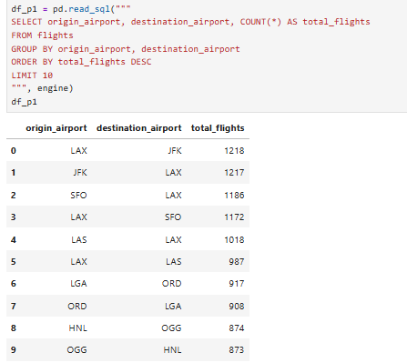 |
| **P2** | Top 5 aerolíneas con mayor porcentaje de vuelos cancelados | 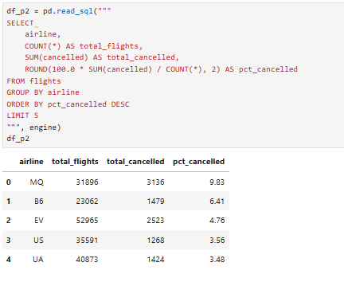 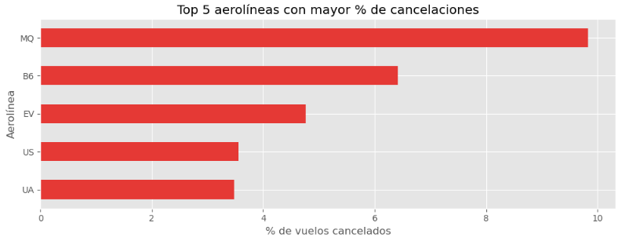 |
| **P3** | Cancelaciones por cada causa (`CANCELLATION_REASON`), excluyendo `NULL` | 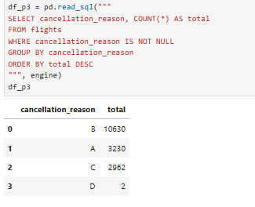 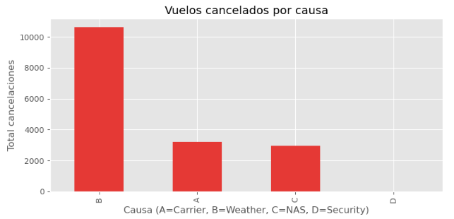 |
| **P4** | Retraso promedio de salida por mes (solo vuelos retrasados y no cancelados: `cancelled = 0 AND departure_delay > 0`) | 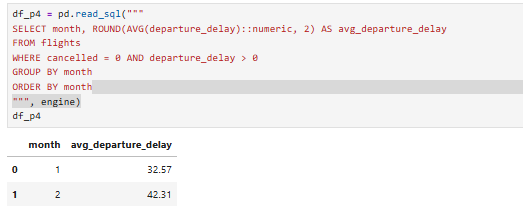 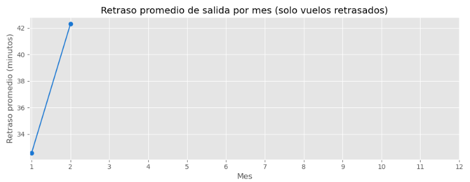 |
| **P5** | Top 10 aeropuertos de origen con más minutos de weather delay | 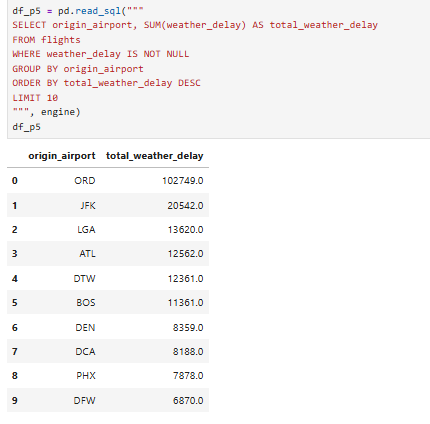 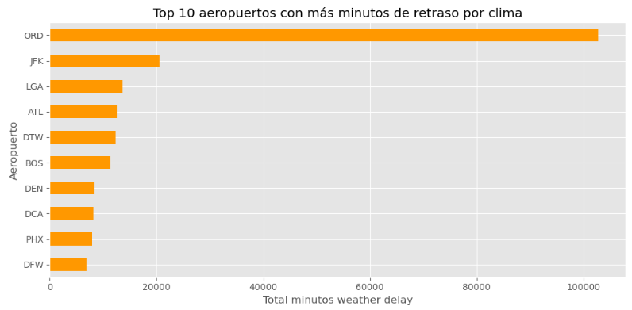 |

### Preguntas con Window Functions

| ID | Pregunta | Window Function | Screenshot |
|---|---|---|---|
| **W1** | Vuelo con mayor retraso de llegada por aerolínea (rank 1) | `RANK() OVER (PARTITION BY airline ORDER BY arrival_delay DESC NULLS LAST)` | 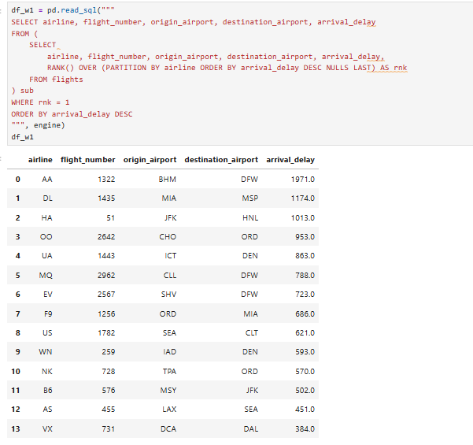 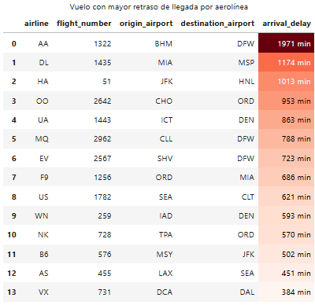 |
| **W2** | Variación mes a mes en total de vuelos durante 2015 (diferencia absoluta y % de cambio) | `LAG() OVER (ORDER BY month)` | 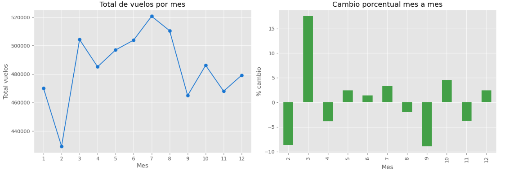 |
| **W3** | Primeros 5 vuelos del día en LAX (2015-01-01) por horario programado | `ROW_NUMBER() OVER (PARTITION BY (year, month, day, origin_airport) ORDER BY scheduled_departure)` | 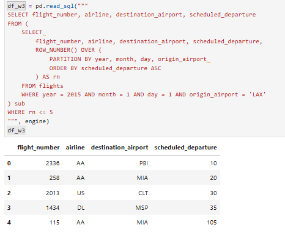 |

> **Nota:** W2 se ejecuta sobre `flights_silver.flights_monthly` en Athena (no en PostgreSQL), ya que la carga parcial en RDS solo cubre enero y parte de febrero. La visualización se encuentra en el notebook.

---

## 🚀 Ejecución Completa

### Prerequisitos

1. Ambiente **SageMaker Studio** con acceso a S3, Glue y Athena.
2. Dataset descargado en `data/flights/` (ver `download_data.sh`).
3. Dependencias instaladas:

```bash
pip install -r requirements.txt
```

### Pipeline — Ejecutar en Orden

```bash
# 1. Bronze — CSV → Parquet → S3 + Glue
python etl/bronze.py --bucket itam-analytics-antonio --data-dir data/flights/

# 2. Silver — Agregaciones de negocio
python etl/silver.py --bucket itam-analytics-antonio

# 3. Gold — CTAS desnormalizado en Athena
python etl/gold.py --bucket itam-analytics-antonio
```

> Cada script depende del anterior: Bronze debe completarse antes de Silver,
> y Bronze antes de Gold.

### Logs Generados

Cada ejecución genera un archivo de log con cifras de control:

| Log | Contenido |
|---|---|
| `logs/bronze_etl.log` | Filas por tabla, chunks procesados, tiempos |
| `logs/silver_etl.log` | Filas Bronze leídas, archivos Parquet, filas/cols por tabla Silver, tiempos |
| `logs/gold_etl.log` | Tabla creada, filas totales, validación de JOINs, tiempos |

### Ejemplo de Cifras de Control (Silver)

```
========================================================================
  CIFRAS DE CONTROL
------------------------------------------------------------------------
  Bronze filas leídas       : 5,819,079
  Archivos Parquet leídos   : 12
------------------------------------------------------------------------
  flights_daily             :    365 filas,  8 cols
  flights_monthly           :    168 filas,  7 cols
  flights_by_airport        :    322 filas,  6 cols
------------------------------------------------------------------------
  Extract + Transform       : 42.3 s
  Load                      :  8.1 s
  Total                     : 50.4 s
========================================================================
  ✓ SILVER LAYER COMPLETED SUCCESSFULLY
========================================================================
```
